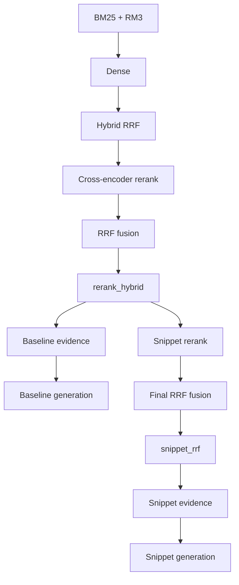

# BioASQ: retrieval + reranking + generation experiments

This repo collects data prep, retrieval, and evaluation code for BioASQ Phase-A style document retrieval.

## Plan and Goals

- Stage 1 retrieval: combine retrievers (BM25+RM3, dense, hybrid) , fetch ~500-2000 docs per query, .
- Stage 2 reranking: cross-encoder model, focus on precision at top ranks (MAP@10, MRR@10).
- Stage 3 (optional): snippet window extraction + reranking (for snippet-style evidence).
- Metrics: use MeanR@K for stages 1-2; MAP@10/MRR@10 at the top ranks for rerank + downstream routes.

## Methods

### Index preparation (before running the pipeline)

The pipeline expects a **BM25 (Terrier) index** and a **Dense (HNSW) index**. Build them once from JSONL document shards (e.g. PubMed baseline):

- **BM25:** [scripts/public/shared_scripts/index/build_bm25_index_from_jsonl_shards.py](scripts/public/shared_scripts/index/build_bm25_index_from_jsonl_shards.py)
- **Dense:** [scripts/public/shared_scripts/index/build_dense_hnsw_index_from_jsonl_shards.py](scripts/public/shared_scripts/index/build_dense_hnsw_index_from_jsonl_shards.py)

Point `BM25_INDEX_PATH` and `DENSE_INDEX_DIR` in your pipeline config to these outputs. For data prep (parse XML to JSONL, subset) and full indexing commands see [docs/USAGE.md](docs/USAGE.md).

### Run the full pipeline (recommended)

The easiest way to run retrieval and reranking is the pipeline script with a config file. It runs BM25 → Dense → Hybrid (and optionally Reranker), skips stages whose output already exists, and uses one config for all options.

- **Script:** [scripts/public/shared_scripts/run_retrieval_rerank_pipeline.sh](scripts/public/shared_scripts/run_retrieval_rerank_pipeline.sh)
- **Example configs:** [workflow_config_baseline.env](scripts/public/shared_scripts/workflow_config_baseline.env) (baseline defaults), [workflow_config_small.env](scripts/public/shared_scripts/workflow_config_small.env) (small run), [workflow_config_snippet.env](scripts/public/shared_scripts/workflow_config_snippet.env) (snippet-RRF route example), [workflow_config_full.env](scripts/public/shared_scripts/workflow_config_full.env) (full options)
- **Run (from repo root):** `./scripts/public/shared_scripts/run_retrieval_rerank_pipeline.sh --config scripts/public/shared_scripts/workflow_config_baseline.env`  
  Use `--no-rerank` to run only BM25, Dense, and Hybrid.

Pipeline config and env→script mapping: [scripts/public/README.md](scripts/public/README.md).

### Pipeline routes (baseline vs snippet-RRF)

The pipeline has a baseline document-evidence route and an optional snippet-RRF route (for snippet-style contexts).

- **Baseline route outputs**: `rerank_hybrid/`, `evidence_baseline/`, `generation_baseline/`
- **Snippet-RRF route outputs**: `snippet_rerank/`, `snippet_rrf/`, `evidence_snippet/`, `generation_snippet/`

### First Stage Retrieval

- **BM25 + RM3** ([script](scripts/public/shared_scripts/retrieval/eval_bm25_rm3.py), [notebook](notebooks/bm25_test.ipynb))
  - Keyword retrieval with RM3 query expansion
  - Tunable: `--rm3_fb_docs`, `--rm3_fb_terms`, `--rm3_lambda`

- **Dense Retrieval** ([script](scripts/public/shared_scripts/retrieval/eval_dense.py), [notebook](notebooks/dense_test.ipynb))
  - SentenceTransformer embeddings + HNSW index
  - Models: MedEmbed-small-v0.1 (default), PubMedBERT
  - Tunable: `--ef_search`, `--ef_cap`, embedding model

- **Hybrid** reciprocal Rank Fusion combining BM25 and dense
  - ([notebook](notebooks/hybrid.ipynb))
  - Tuning knobs: `K_RRF`, BM25/dense weight ratio

### Second Stage Reranking

- Cross-encoder reranker that re-scores stage-1 candidates using (query, title+abstract) pairs.
- Typical flow: take top ~200-2000 per query, re-rank.

Tunable parameter ranges: [docs/PARAMETERS.md](docs/PARAMETERS.md)

## Results

Recall metrics for stages 1-2. Full tables are in [docs/RESULTS.md](docs/RESULTS.md).

| Method | MeanR@2000 (13B test avg) |
|--------|---------------------------|
| BM25_RM3 | 0.856 |
| Dense (MedEmbed)    | 0.787 |
| Hybrid | 0.907 |

Hybrid details: [notebooks/hybrid.ipynb](notebooks/hybrid.ipynb)

## Detailed commands

See [docs/USAGE.md](docs/USAGE.md) for detailed setup and evaluation commands.  
Pipeline config and options (env vars and how they map to each script): [scripts/public/README.md](scripts/public/README.md).

## Environment

 `pip install pyterrier sentence-transformers hnswlib pyarrow pandas numpy scipy`

## TODO

- look at zero or low recall quries manaully after 1.st retrieval
- snippet analysis and ablations (window sizes, fusion weights)
