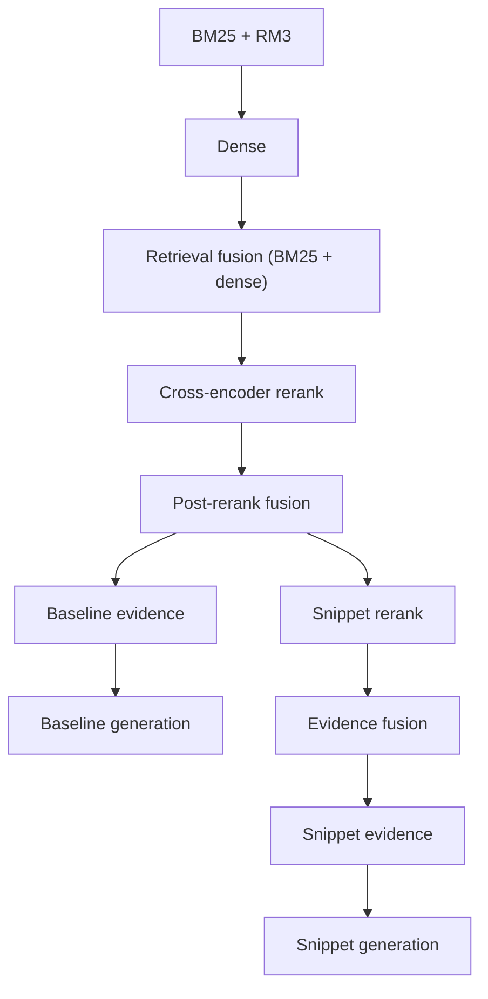

# BioASQ: retrieval + reranking + generation experiments

This repo collects data prep, retrieval, and evaluation code for BioASQ Phase-A style document retrieval.

## Plan and Goals

- Stage 1: hybrid retrieval (BM25+RM3, dense, retrieval fusion), fetch ~500-2000 docs per query.
- Stage 2: document-level reranking with a cross-encoder 
- Stage 2b: Post-rerank fusion at the top ranks (focus on MAP@10).
- Stage 3: (optional): Snippet-aware evidence reranking
- Stage 3b (optional): Evidence (document and snippet) fusion
- Stage 4: LLM answer generation from baseline or snippet-based evidence.
- Metrics: use MeanR@K for stages 1-2; MAP@10 at the top ranks for rerank + downstream routes.

## Methods

### Index preparation (before running the pipeline)

The pipeline expects a **BM25 (Terrier) index** and a **Dense (HNSW) index**. Build them once from JSONL document shards (e.g. PubMed baseline):

- **BM25:** [scripts/public/shared_scripts/index/build_bm25_index_from_jsonl_shards.py](scripts/public/shared_scripts/index/build_bm25_index_from_jsonl_shards.py)
- **Dense:** [scripts/public/shared_scripts/index/build_dense_hnsw_index_from_jsonl_shards.py](scripts/public/shared_scripts/index/build_dense_hnsw_index_from_jsonl_shards.py)

Point `BM25_INDEX_PATH` and `DENSE_INDEX_DIR` in your pipeline config to these outputs. For data prep (parse XML to JSONL, subset) and full indexing commands see [scripts/public/shared_scripts/docs/USAGE.md](scripts/public/shared_scripts/docs/USAGE.md).

### Run the full pipeline (recommended)

The easiest way to run retrieval and reranking is the pipeline script with a config file. It runs BM25 → Dense → retrieval fusion (BM25 + dense) → Reranker, skips stages whose output already exists, and uses one config for all options.

- **Script:** [scripts/public/shared_scripts/run_retrieval_rerank_pipeline.sh](scripts/public/shared_scripts/run_retrieval_rerank_pipeline.sh)
- **Example configs:** [workflow_config_baseline.env](scripts/public/shared_scripts/workflow_config_baseline.env) (baseline defaults), [workflow_config_snippet.env](scripts/public/shared_scripts/workflow_config_snippet.env) (snippet-RRF route example), [workflow_config_full.env](scripts/public/shared_scripts/workflow_config_full.env) (full options)
- **Run (from repo root):** `./scripts/public/shared_scripts/run_retrieval_rerank_pipeline.sh --config scripts/public/shared_scripts/workflow_config_baseline.env`  
  Use `--no-rerank` to run only BM25, Dense, and retrieval fusion; use `--no-generation` to skip LLM answer generation while still building evidence.

Pipeline config and env→script mapping: [scripts/public/README.md](scripts/public/README.md).

### Pipeline routes (baseline vs snippet-RRF)

The pipeline has a baseline document-evidence route and an optional snippet-RRF route (for snippet-style contexts).

- For a detailed map of pipeline outputs (including baseline and snippet-RRF routes), see [scripts/public/shared_scripts/docs/output.md](scripts/public/shared_scripts/docs/output.md).

### First Stage Retrieval

- **BM25 + RM3**
  - Keyword retrieval with RM3 query expansion.

- **Dense Retrieval**
  - SentenceTransformer embeddings + HNSW index.
  - Default model: MedEmbed-small-v0.1.

- **Retrieval fusion**: reciprocal Rank Fusion combining BM25 and dense runs.

### Second Stage Reranking

- Cross-encoder reranker that re-scores stage-1 candidates using (query, title+abstract) pairs.
- Typical flow: take top ~200-2000 per query, re-rank.
- Post-rerank fusion combining reranker scores and retrieval fusion (stage 1) results.

### Snippet Reranking (optional)

- Sliding-window extraction over top documents from Second Stage Reranking: each abstract is split into overlapping sentence windows, scored by a two-stage dense + cross-encoder pipeline, then the best window score becomes the document's snippet score.
- Final RRF fusion blends document-level and snippet-level rankings into a single ranking used for snippet-based evidence.

### Answer Generation

- Baseline evidence uses document-level contexts built from title and abstract text (truncated to a fixed character budget per passage).
- Snippet evidence uses title plus the highest-scoring sliding windows from the snippet reranking stage as compact contexts.
- Default model: `llama3.3:latest` via Ollama with `temperature=0.0` for deterministic output.
- Note: this part is currently wired to a personal/local LLM endpoint; this step can be skipped via `--no-generation` (or adapted to your own API) without affecting retrieval and reranking reproducibility.

Scripts, configs, and detailed usage: [scripts/public/README.md](scripts/public/README.md).

## Results

Full results are in [docs/RESULTS.md](docs/RESULTS.md).

## Detailed commands

See [scripts/public/shared_scripts/docs/USAGE.md](scripts/public/shared_scripts/docs/USAGE.md) for detailed setup and evaluation commands.

## Environment

For a reproducible environment see [Dockerfile](Dockerfile).

