# BioASQ Working Note

## Methods

### Pipeline overview

The system is a three-stage retrieve–rerank–generate pipeline for BioASQ Task 14b Phase A (document retrieval). Generation is implemented but is out of scope for this working note. The flow is summarised in Figure 0.

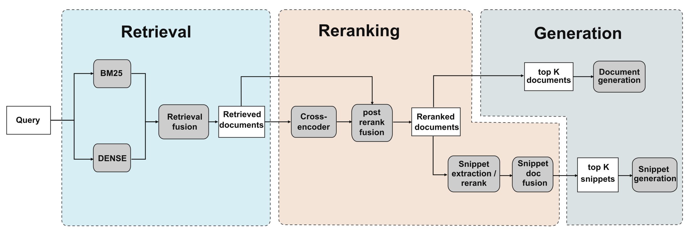

For each query the pipeline executes:

1. **First-stage retrieval.** BM25+RM3 and a dense bi-encoder over a PubMed HNSW index produce two ranked lists of candidate PubMed abstracts. The two lists are fused by reciprocal rank fusion (RRF).
2. **Cross-encoder reranking.** The top *N* candidates from stage 1 are rescored by a cross-encoder, and the reranked list is fused again with the stage-1 list by a second RRF ("post-rerank fusion").
3. **Two downstream routes.** A *document route* feeds the top-K reranked abstracts to the LLM directly; a *snippet route* extracts local sentence windows from the same top-200 shortlist, reranks the windows with the same cross-encoder, and fuses snippet and document scores before evidence is assembled. Generation is not evaluated here.

The orchestrator and per-stage scripts live in `scripts/public/shared_scripts/`. The subsections below describe each stage and its default hyperparameters; Table 1 lists every experiment evaluated in §1–§5 and points to the corresponding figure.

### Experiments (Table 1)

| ID | Experiment | Question | Split | Section / figure |
|---|---|---|---|---|
| E1 | First-stage retrieval — BM25 vs dense vs RRF hybrid | Does dense retrieval add coverage beyond BM25+RM3? | Dev + 13B1–4 | §1, Fig 1 |
| E2 | HyDE on dense retrieval | Do hypothetical-answer queries improve dense recall? | Dev small + 13B subset | §1, Fig 2 |
| E3 | Cross-encoder reranking + post-rerank fusion | Does CE rerank improve over hybrid? Is RRF(CE, hybrid) additive? | Dev + 13B1–4 | §2, Figs 3–4 |
| E4 | Reranker comparison (bge-v2-gemma 2.5B / bge-v2-m3 / MiniLM / bge-v2-m3 tok_len = 200) | Which CE gives the best MAP@K? Does input truncation hurt? | Dev (de-duplicated) + 13B1–4 | §2, Fig 5 |
| E5 | Per-query diagnostics — by `|gold|` bucket | Where does the pipeline lose precision as the relevant set grows? | Dev + 13B1–4 (n = 923) | §3, Figs 6–7 |
| E6 | Per-query diagnostics — by question length | Are short questions harder, and is the loss in retrieval or in ranking? | Dev + 13B1–4 (n = 923) | §3, Figs 8a–8b |
| E7 | Snippet route — snippet rerank + doc/snippet RRF weight sweep | Does the snippet route preserve document MAP while compressing evidence for the LLM? | Dev + 13B1–4 | §4, Fig 9 |
| E8 | Query rewriting (no-rewrite vs conservative vs broad) | Does LLM query rewriting improve MAP? | Dev small + 13B subset | §5, Fig 10 |

### Corpus and indexing

The corpus is the PubMed abstract dump distributed with the BioASQ 13 task, parsed by `data/parse_pubmed_local.py` into JSONL shards (one record per PMID with `title` and `abstract` fields). Two indices are built over the same shards: a Terrier BM25 index (`index/build_bm25_index_from_jsonl_shards.py`, default term pipeline, Java 21) and a dense HNSW index (`index/build_dense_hnsw_index_from_jsonl_shards.py`; `M = 32`, `ef_construction = 200`, `ef_search = 100`) embedded with `abhinand/MedEmbed-small-v0.1`.

### Stage 1 — first-stage retrieval

**BM25 with RM3 query expansion** (`retrieval/retrieve_bm25.py`; feedback pool 50 documents, 20 feedback documents, 30 feedback terms, λ = 0.6) produces the lexical candidate list. **Dense retrieval** (`retrieval/retrieve_dense.py`) queries the HNSW index with the same SentenceTransformer encoder used to build it. Both stages return the top 5000 candidates per query. **Retrieval fusion** (`retrieval/fuse_retrieval.py`) combines the two lists with reciprocal rank fusion, RRF(*d*) = Σᵢ wᵢ / (k_rrf + rankᵢ(*d*)). The pipeline sweeps k_rrf ∈ {60, 100} and weight tuples (1, 1), (2, 1), (1, 2) and picks the configuration with the highest Recall@5000 on dev; our operating point is k_rrf = 60, (w_BM25, w_dense) = (1, 1).

**HyDE.** For the HyDE experiment (Figure 2) the original query is replaced by a short hypothetical answer-like passage generated from the question body. The passages are precomputed offline (`example/hyde/`) and passed to `retrieve_dense.py` via the `query_text_hyde` field. Gating is type-aware: HyDE is applied to list, summary, and short-factoid questions; skipped for yes/no and numeric/measurement-sensitive factoid questions.

### Stage 2 — cross-encoder reranking and post-rerank fusion

**Cross-encoder rerank** (`rerank/rerank_crossencoder.py`) rescores each (query, document) pair and produces a fully reordered list of the stage-1 candidates (capped at 2000 per query). For the reranker-comparison results (Figure 5) we also evaluate `BAAI/bge-reranker-v2-gemma` (2.5 B, LLM-style reranker), the same `bge-reranker-v2-m3` with `max_length = 200`, and `cross-encoder/ms-marco-MiniLM-L-12-v2`.

**Post-rerank fusion** (`rerank/fuse_rerank.py`) combines the reranked top-K and the stage-1 fused top-K with a second RRF at k_rrf = 60 and (w_rerank, w_retrieval) = (0.8, 0.2). We use pool = 50 for the document route (`rerank_hybrid/`) and pool = 200 for the snippet route (`rerank_hybrid_200/`). The output of this stage is what we refer to as *post-rerank fusion* in the figures.

### Snippet branch

The snippet branch operates inside the already-shortlisted document set produced by post-rerank fusion (top 200 documents). For each (query, document) pair we extract overlapping sentence windows of 3 sentences with stride 1 (`evidence/rerank_snippets.py`) and rescore them with the same cross-encoder as in stage 2. The window scores are then fused with the document scores by RRF at k_rrf = 60 and default weights (w_doc, w_snippet) = (0.8, 0.2); Figure 9 (bottom row) sweeps the doc/snippet weight from (1.0, 0.0) to (0.0, 1.0). Snippet contexts are emitted one per distinct PMID (chunks aggregated). For the snippet ablation in Figure 9 (top row) we also report a MedCPT bi-encoder + cross-encoder variant.

### Evaluation

All metrics are computed against the BioASQ gold relevance set (the `documents` field of each question). The PMID for a candidate is taken as the trailing path component of the gold URL or the raw docno. **Mean Recall@K** is the average over queries of |retrieved_top_K ∩ gold| / |gold|, reported at K ∈ {50, 100, 200, 300, 400, 500, 1000, 2000, 5000} (capped at 300 for the stage-2 curves). **MAP@K** is reported at K ∈ {1, 3, 5, 10, 20, 30, 40, 50, 75, 100} and computed as in BioASQ Phase A: AP@K = (1/min(|gold|, K)) · Σᵢ (hitsᵢ / i), where the sum is over the top-K ranks and hitsᵢ counts relevant documents up to rank *i*; MAP@K is the mean over queries. For the per-query analyses (Figures 6–8) the same per-query AP@K and Recall@K are computed directly from the run TSVs against the gold qrels, and queries are grouped by |gold| or by question word count.

### Splits

For most experiments:

- **Dev**: 583 questions; about a 10 % random sample of all training questions, plus a small set of difficult cases where BM25 fails to retrieve any gold-relevant document even at a relatively deep cutoff.
- **13B1–B4**: the four BioASQ 13 test batches; 85 questions per batch.

For query rewriting and HyDE:

- **Dev small**: 192 questions; a smaller random subset of Dev.
- **13B subset**: a random sample of 50 questions drawn from 13B1–B4.

Per-query analyses (Figures 6–8) merge Dev with 13B1–B4 (n = 923 questions). For the reranker comparison (Figure 5) we drop any Dev queries whose IDs overlap with 13B1–B4 to avoid train/eval leakage.

## Results

The Results section is organised in five parts. §1 covers first-stage retrieval and the HyDE augmentation of dense retrieval. §2 covers cross-encoder reranking, post-rerank fusion, and the comparison of reranker models. §3 looks at where the pipeline still loses, stratified by gold-document count and by question length. §4 evaluates the snippet route — used downstream as an evidence-compression mechanism — and asks whether it preserves document MAP when snippets stand in for full abstracts. §5 reports a query-rewriting ablation that did not improve MAP.

### 1. Stage 1 — First-stage retrieval

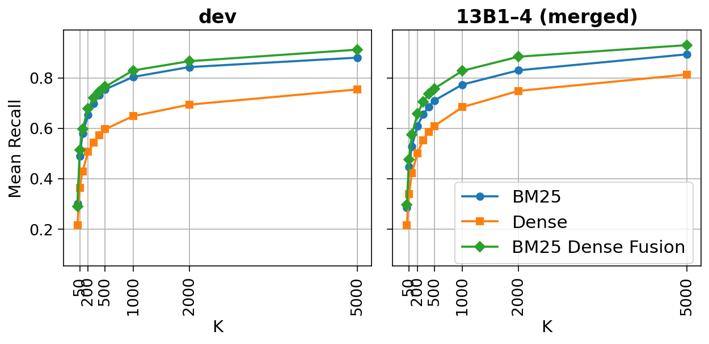

BM25–dense fusion achieves the best recall on dev and on the merged 13B1–4 test set across almost all K. BM25 alone is consistently better than dense alone. The advantage of fusion appears early and persists at larger cutoffs.

These curves support using reciprocal rank fusion as the primary first-stage retriever. The hybrid gain over BM25 shows that dense retrieval contributes additional relevant documents beyond lexical matching, but the strong BM25 baseline and the weak early dense recall indicate that lexical evidence remains the dominant signal in this setting.

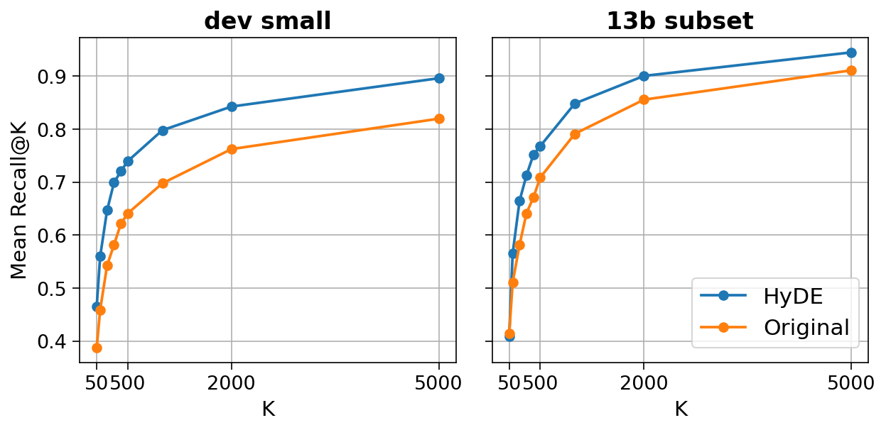

HyDE (Hypothetical Document Embeddings) generates a short hypothetical answer-like passage from the query and uses that generated text, rather than the raw query, for dense retrieval. HyDE improves dense-retrieval recall over the original query on both dev small and the 13B subset across nearly all cutoffs. The gain appears early and remains positive up to large K.

### 2. Stage 2 — Cross-encoder reranking

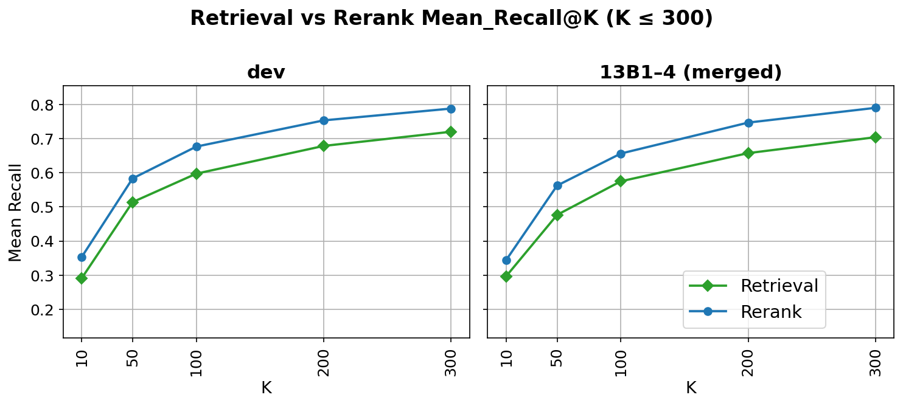

Across dev and the merged test set, reranking yields higher recall than the stage-1 hybrid retrieval at every evaluated cutoff up to K = 300. The gain appears already at K = 10 and remains stable through K = 300.

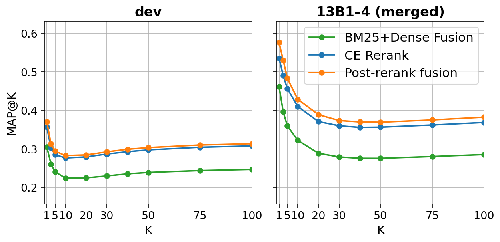

Reranking improves MAP over stage-1 retrieval on dev and the merged test set, and post-rerank fusion gives the best MAP@K in every split. The MAP@K curves show the same overall pattern across the full cutoff range: rerank is consistently better than retrieval, and post-rerank fusion is usually best.

These results show that the cross-encoder adds clear ranking value beyond candidate retrieval alone, improving not only recall at small cutoffs but also the placement of relevant documents near the top of the list. The additional gain from post-rerank fusion indicates that the reranked list and the original hybrid ranking are not redundant: reranking sharpens local ordering among retrieved candidates, while fusion preserves useful stage-1 evidence that would otherwise be lost when relying on the reranker alone.

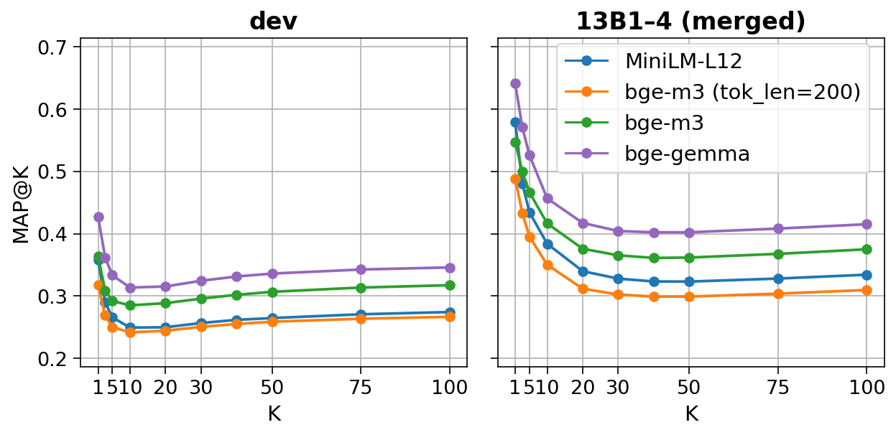

Across dev and the merged test set, the 2.5 B **bge-reranker-v2-gemma** gives the highest MAP@K at every evaluated cutoff. The full-length **bge-reranker-v2-m3** is consistently second. **ms-marco-MiniLM-L-12-v2** and the truncated **bge-reranker-v2-m3** with `tok_len = 200` are weaker, with the truncated variant usually worst. The ranking between models is stable across K: curves drop sharply from very small K to around K = 10–20, then flatten, but their ordering does not change.

These results show a clear capacity effect in the reranking stage: larger rerankers produce better document ordering once candidate retrieval is fixed. The advantage of the 2.5 B model is not limited to MAP@10 but persists across the full cutoff range, which suggests that its gain is due to better relevance estimation rather than only sharper top-1 decisions. The drop from full-length **bge-reranker-v2-m3** to its `tok_len = 200` version indicates that aggressive input truncation removes useful evidence and materially hurts ranking quality.

### 3. Diagnostics — where the pipeline still fails

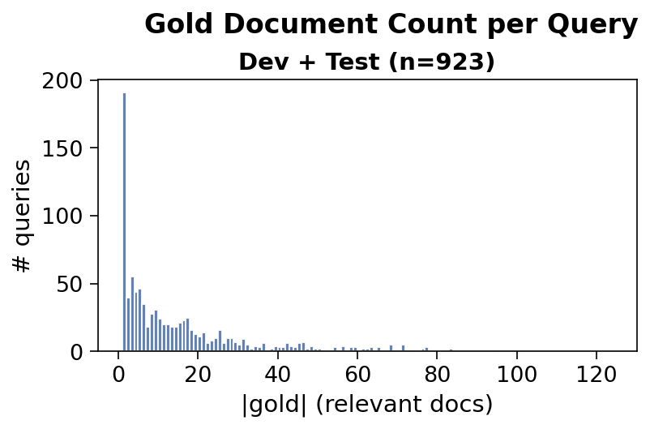

The relevance-set size is highly skewed: a visible spike occurs at |gold| = 1, but the overall distribution is long-tailed and most queries still have more than five relevant documents. We use this to stratify the per-query analyses below into four buckets: |gold| ∈ {1, 2, 3–5, >5}.

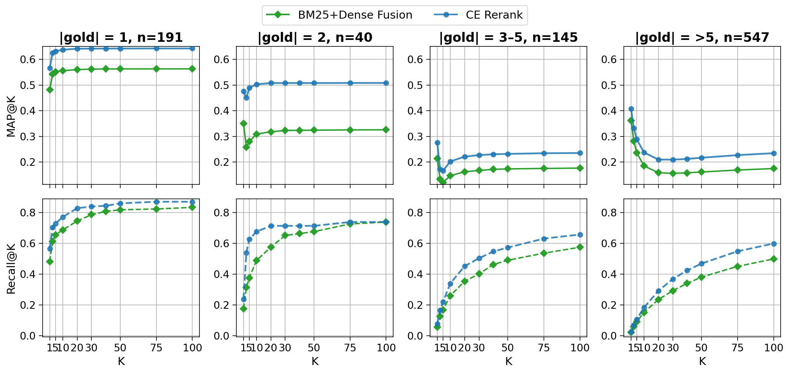

MAP@K depends strongly on |gold|. Queries with one or two relevant documents achieve the highest MAP, queries with three to five — or more — are substantially lower. Across all gold-count buckets, reranking improves over hybrid retrieval.

For |gold| = 1 or 2, MAP is high and stabilises almost immediately, while recall continues to grow only slightly with larger K; rerank and post-rerank fusion are nearly identical. For |gold| ≥ 3, recall keeps increasing with K, but MAP drops after the first few ranks and recovers only slightly later. This gap is largest for |gold| > 5, where post-rerank fusion gives the best trade-off between early precision and broader recall.

The lower MAP for large-|gold| queries is therefore not mainly a failure to retrieve relevant documents. Relevant documents are still being accumulated as K grows, but many are ranked too deep to preserve high early precision. The difficulty shifts from finding any relevant item to ordering many relevant items near the top. That is why reranking helps in every bucket, but fusion becomes most useful when |gold| is large: it retains the broader coverage of hybrid retrieval while preserving the sharper top-rank ordering from the reranker.

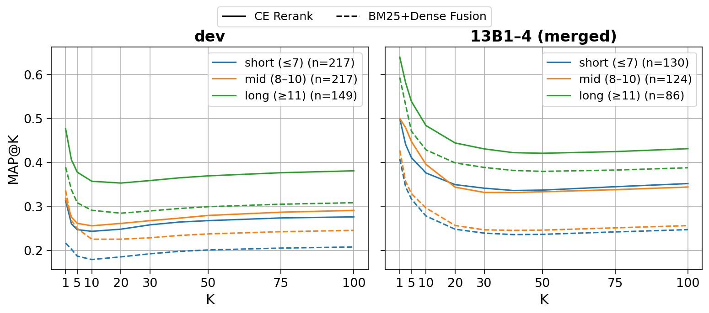

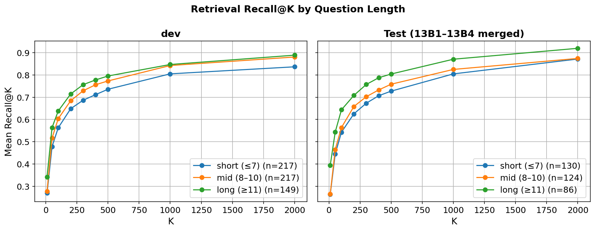

Question length is strongly associated with ranking quality. In both dev and merged test, long questions (≥ 11 tokens) achieve the highest MAP@K, mid-length questions are intermediate, and short questions (≤ 7) are worst across the full cutoff range. Reranking improves MAP for all three length bins, but it does not remove the gap between short and long questions. Retrieval recall shows the same ordering: long questions have the highest Recall@K and short questions the lowest, although all bins reach reasonably high recall by large K.

Short questions are difficult for both retrieval and ranking, likely because they provide less lexical and semantic constraint. However, the main loss is not only missing candidates: recall for short questions rises steadily and becomes fairly high at large K, while MAP remains clearly below the longer-question bins. The system often retrieves relevant material for short questions but does not place it early enough. Reranking helps in every bin, so better within-candidate ordering is part of the solution, but the persistent gap indicates that short-question ambiguity remains unresolved even after reranking.

### 4. Snippet route — context compression for downstream generation

The snippet route is not an alternative document retriever. It starts from the same top-200 documents produced by post-rerank fusion, extracts local sentence windows, rescores them with the same cross-encoder, and fuses snippet and document scores into a final ranking. Its purpose is to localise the most relevant evidence inside already-good documents so that downstream generation can fit more queries' worth of evidence into a finite LLM context window — many BioASQ questions have several relevant abstracts, and feeding full abstracts quickly exhausts the budget.

The question for this route is therefore not whether snippet-aware ranking *improves* document MAP, but whether it *preserves* it once snippets stand in for full abstracts.

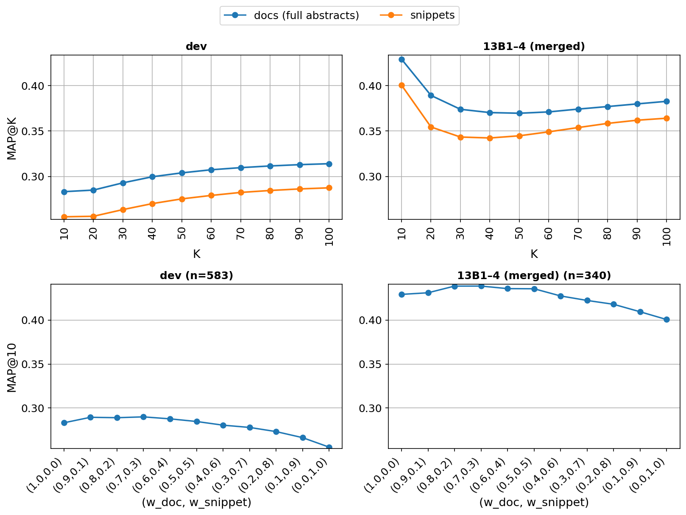

Full-abstract reranking gives higher MAP@K than snippet-only reranking on both dev and the merged test set across the cutoff range, which is expected: the snippet scorer sees less context per document. The relevant observation is in the weight sweep (bottom row): doc/snippet RRF fusion essentially recovers document-only MAP. Document-heavy mixtures around (w_doc, w_snippet) = (0.8, 0.2) are within a small margin of pure-document MAP@10 on every split, while snippet-heavy settings degrade more visibly. The route therefore delivers compact, snippet-level evidence for the LLM without measurably degrading document ranking — a trade we are willing to take whenever the generation stage is context-bound.

Improving document MAP via snippets in this configuration is structurally hard: the snippet branch operates inside the already strong top-200 shortlist, so it can refine the ordering of evidence near the top but cannot surface new high-value documents. We read the result not as a failed ablation but as the expected behaviour of a downstream-facing component, evaluated on a metric (document MAP) that is *not* its target.

### 5. Query rewriting — no MAP improvement

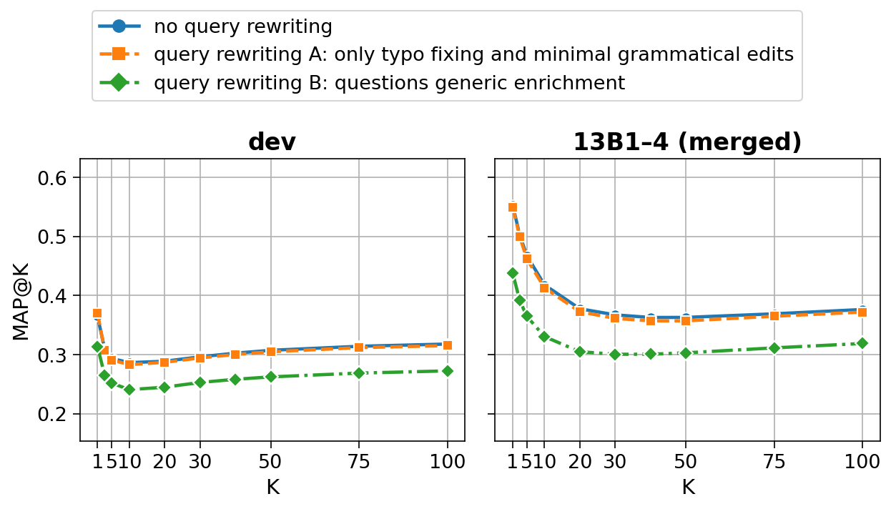

In the current reranking setup, query rewriting does not improve MAP@K. The no-rewrite baseline and the conservative rewrite variant A are nearly identical across dev and the merged test set, with only negligible differences at some cutoffs. The broader rewrite variant B is consistently worse, with a clear drop across the full K range.

These results suggest that reranking is already robust to minor query noise, so typo fixing and light grammatical cleanup add little once a strong candidate set has been retrieved. At the same time, generic query enrichment appears harmful: adding broader or more interpretive wording likely dilutes the original information need and weakens query–document matching for the reranker.

## Discussion

**Where the gains come from.** The pipeline's document-ranking performance is built up additively from three complementary signals. BM25+RM3 alone is the strongest single retriever, but hybrid RRF with the dense bi-encoder consistently improves recall, so the dense branch is best understood as adding semantic coverage rather than replacing lexical matching. HyDE further improves the dense side by converting terse queries into answer-like passages, partially closing the query–document wording gap that hurts the bi-encoder. The cross-encoder reranker then delivers the largest single jump in MAP, and post-rerank fusion of the reranked list with the original hybrid ranking is best or tied-best at every K — the two lists are not redundant. Capacity in the reranker matters: the 2.5 B bge-reranker-v2-gemma dominates at every cutoff, full-length bge-reranker-v2-m3 is consistently second, and the truncated `tok_len = 200` variant is worst, confirming that both model size and access to enough document context are load-bearing.

**Where it still fails.** The diagnostic plots point to a single underlying mechanism. For queries with one or two relevant documents, MAP saturates almost immediately; for queries with three or more relevant documents, recall keeps growing with K but MAP drops and only partially recovers. The system is retrieving the relevant material — it is just ranking too much of it too deep. The question-length analysis tells the same story from a different angle: short questions have lower MAP than long questions across the full range, while their recall reaches respectable levels by large K. In both cases, the bottleneck is early-rank ordering of a broad relevant set rather than missing candidates. This is why post-rerank fusion becomes most useful on the hard |gold| buckets — broad stage-1 coverage still carries information that pure rerank decisions can lose.

**The snippet route, repositioned.** The snippet route is not designed to improve document MAP and should not be judged as such. It compresses already-good documents into localised sentence windows so that the LLM context window can hold evidence for more queries. The empirical question is whether that compression damages ranking — and the doc/snippet RRF fusion shows it does not: at the default (w_doc, w_snippet) = (0.8, 0.2) the route is within a small margin of document-only MAP@10 while emitting substantially more compact contexts. The right comparison for this component is end-to-end generation quality under a fixed context budget, which is left to downstream evaluation.

**Query rewriting did not help.** Query rewriting is genuinely neutral or harmful in this configuration: conservative typo/grammar edits leave MAP unchanged, and broader interpretive enrichment consistently reduces it. The reranker is already robust to minor surface variation, and generic expansion dilutes the information need rather than clarifying it. Unlike the snippet route, this is a negative result on the metric the component targets.

**Implications.** Future improvements should target ordering within broad relevant sets — stronger rerankers with full document context, or learned post-rerank fusion that adapts to |gold| — and disambiguation of short questions, where stage-1 weakness compounds with stage-2 limitations. The snippet route is best evaluated end-to-end through generation quality under a fixed LLM context budget rather than through document MAP; text-level query reformulation does not appear to be a productive direction in this pipeline.
